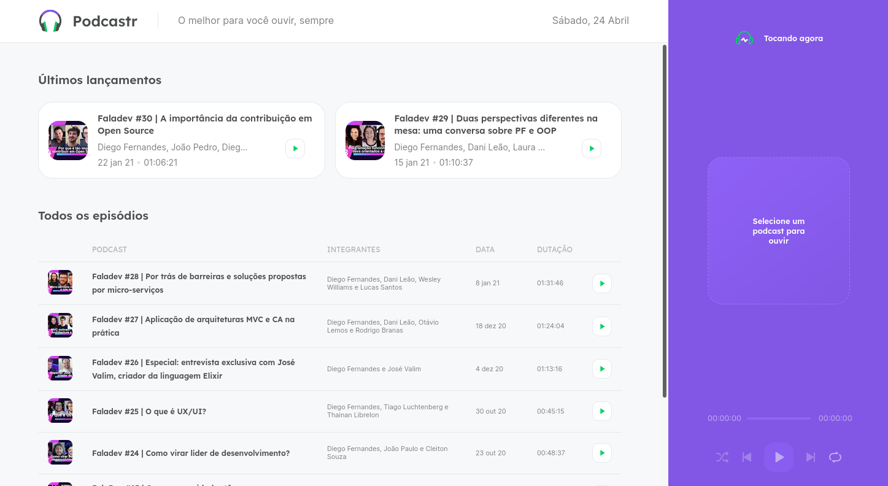
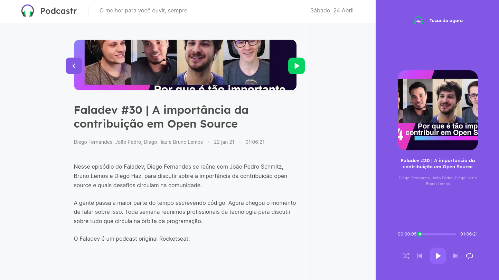

# Project Podcastr

Project carried out during the Next Level Week (NLW) event, where the company Rocketseat offers study trails, so that the Dvs reach the next level in their careers.

####Work with NextJs, TypeScript and Json Server

---

<p align="center">
  
</p>

<p align="center">
  
</p>

## Getting Started

First, install all dependencies:

```bash
npm install
# or
yarn
```

Second, run json server:

```bash
yarn server
```

First, run the development server:

```bash
npm run dev
# or
yarn dev
```

Open [http://localhost:3000](http://localhost:3000) with your browser to see the result.


